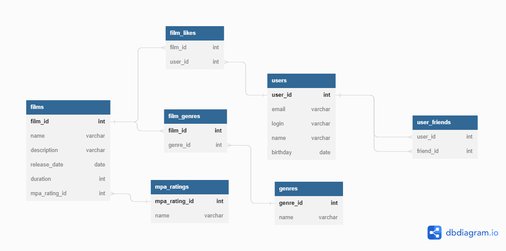

# java-filmorate


<details>
  <summary>Users:</summary>

* Create User
```SQL
INSERT INTO users (email, login, name, birthday)
VALUES (<email>, <login>, <name>, <birthday>);
```
* Update User
```SQL
UPDATE users
SET email = <email>,
    login = <login>,
    name = <name>,
    birthday = <birthday>
WHERE user_id = <user_id>
```
* Get All Users
```SQL
SELECT *
FROM users
```
* Get User By Id
```SQL
SELECT *
FROM users
WHERE user_id = <user_id>
```
* Add Friends
```SQL
INSERT INTO user_friends (user_id, friend_id)
VALUES (<user_id>, <friend_id>)
```
* Delete Friends
```SQL
DELETE
FROM user_friends
WHERE user_id = <user_id> AND friend_id = <friend_id>
```
* Get ALl User Friends
```SQL
SELECT u.*
FROM users AS u
INNER JOIN user_friends AS uf ON u.user_id = uf.friend_id
WHERE uf.user_id = <user_id>
```
* Get Common Friends
```SQL
(SELECT u.*
FROM users AS u
INNER JOIN user_friends AS uf ON u.user_id = uf.friend_id
WHERE uf.user_id = <user_id>)
INTERSECT
(SELECT u.*
FROM users AS u
INNER JOIN user_friends AS uf ON u.user_id = uf.friend_id
WHERE uf.user_id = ?)
```
</details>

<details>
  <summary>Films:</summary>

* Create Film
```SQL
INSERT INTO films (name, description, release_date, duration, mpa_rating_id)
VALUES (<name>, <description>, <release_date>, <duration>, <mpa_rating_id>)
```
* Edit Film
```SQL
UPDATE films
SET name = <name>,
    description = <description>,
    release_date = <release_date>,
    duration = <duration>,
    mpa_rating_id = <mpa_rating_id>
WHERE film_id = <film_id>
```
* Get ALl Films
```SQL
SELECT * 
FROM films
```
* Get Film By Id
```SQL
SELECT *
FROM films
WHERE film_id = <film_id>
```
* Set Like To Film
```SQL
INSERT INTO film_likes (film_id, user_id)
VALUES (<film_id>, <user_id>)
```
* Delete Like
```SQL
DELETE
FROM film_likes
WHERE film_id = <film_id> AND user_id = <user_id>
```
</details>

<details>
  <summary>Genres:</summary>

* Create Genre
```SQL
INSERT INTO genres (name)
VALUES (<name>)
```
* Get All Genres
```SQL
SELECT name
FROM genres
```
* Get Genre By Id
```SQL
SELECT *
FROM genres
WHERE genre_id = <genre_id>
```
</details>

<details>
  <summary>Mpa Rating:</summary>

* Create Mpa Rating
```SQL
INSERT INTO mpa_ratings (name)
VALUES (<name>)
```
* Get All Ratings
```SQL
SELECT DISTINCT name
FROM mpa_ratings
```
* Get Rating By Id
```SQL
SELECT name
FROM mpa_ratings
WHERE mpa_rating_id = <mpa_rating_id>
```
</details>